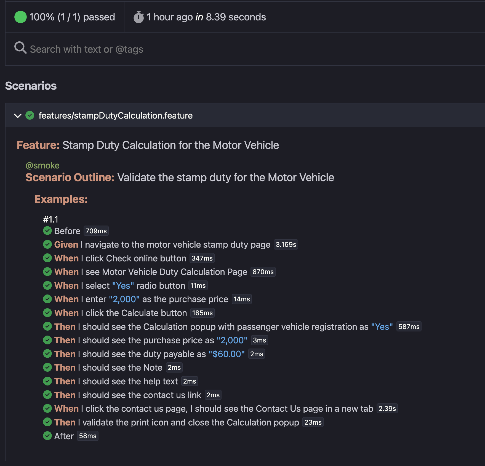

# GUI Automation of Stamp Duty Calculation for Motor Vehicles using Playwright with BDD using cucumber.js

## To automate the user journey of Revenue NSW Calculation for Motor Vehicles

## Technology stack

1. Cucumber.js for BDD as the test runner
2. Playwright for the UI automation
3. @playwright/test for assertions
4. Javascript as the programming language
5. Node
6. Cucumber-html-report

## Project Structure

features - .feature file
fixtures - .fixture.js file
pages - page files for Page Object Model
steps - steps.js file
support - hooks.js
cucumber.js
package.json
README.md

## Installation

npm install -D @cucumber/cucumber
npm install playwright
npm install -D @playwright/test

## Features

The user navigates to the Motor Vehicle Stamp Duty page
Clicks the Check Online button
The Motor Vehicle Registration Duty Calculation page is opened
The user selects the Yes radio button and the Purchase Price
Clicks the Calculate button
The user validates the following details when the Calculation model dialog opens:

- Registration for a passenger vehicle
- Purchase Price
- Duty Payable
- Note
- Contact us page - that gets opened in a new page.

## Running Tests with Tags

npx cucumber-js --tags @smoke

## CI/CD Integration

Github Actions

## Reporting

reports/report.html

